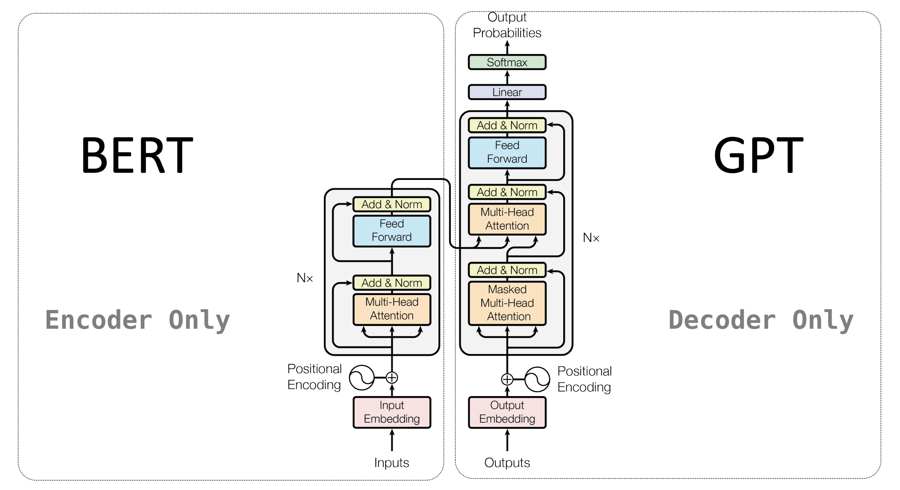
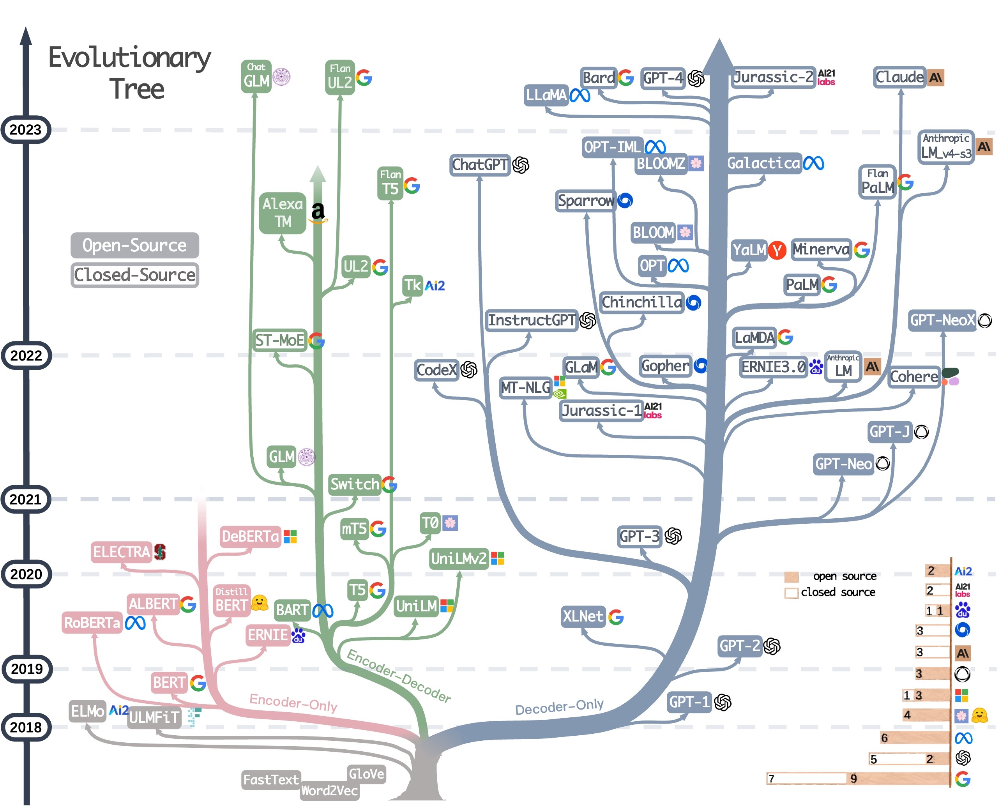
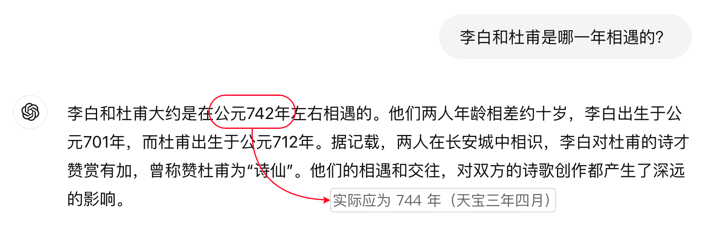
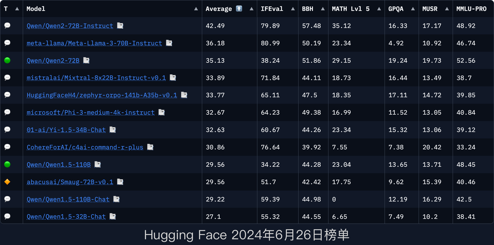

# 一、初识大模型

2020 年，随着 ChatGPT 3 横空出世，“大模型”这一概念迅速引爆科技圈，进入公众视野，成为全民热议的话题。

## 1. 什么是大模型？

“大模型”即“大语言模型” (Large Language Model，缩写：LLM)，它是一种在自然语言处理领域采用超大规模参数和海量数据训练而成的深度神经网络模型。

大语言模型最初的设计目的是为了提高模型对人类语言的理解和表达能力。它本质上只是在预测句子中的下一个单词是什么，经过足够数据量的训练后人们发现这种语言模型可以捕获人类语言的句法和语义，并且能够在训练期间“记住”大量事实。这赋予了大模型更强大的能力，相较于传统的机器学习它能够处理更加复杂的数据和任务。

传统机器学习模型的参数数量通常在百万级到千万级，而大模型则往往拥有数十亿甚至数千亿个参数。为了获得如此大规模的参数，需要利用互联网中海量的文本、图像、视频等非结构化数据来进行预训练，数据集往往高达数十 TB 甚至数百 TB 的规模。

## 2. 大模型的前世今生

### 2.1 早期阶段：统计语言模型

大模型的发展历史可以追溯到20世纪90年代。在深度学习兴起之前，自然语言处理主要依赖于统计学方法。N-gram 模型是这一时期常用的语言模型，通过计算词序列的概率来预测下一个词。然而，统计语言模型在处理长距离依赖和稀疏数据方面表现较差。

2003 年，深度学习领域最有影响力的先驱之一 Bengio 提出了第一个神经语言模型，将词嵌入（Word Embedding）引入到语言建模中。这一模型利用神经网络来捕捉词之间的关系，提高了语言模型的性能。

### 2.2 深度学习阶段

2010 年代初，循环神经网络（RNN）和长短期记忆网络（LSTM）开始应用于语言模型。这些模型能够处理变长序列数据，并捕捉长距离依赖，但由于梯度消失问题，其性能受到一定限制。

2013 年，Google 的 Tomas Mikolov 等人提出了著名的 [Word2vec 模型](https://arxiv.org/abs/1301.3781)。这一模型基于大规模语料库训练的单词嵌入，它使得词汇的连续向量表征成为可能。Word2vec 有效解决了 N-gram 模型中 "curse of dimensionality" 的瓶颈。

2014 年，Ilya Sutskever 与谷歌研究员 Oriol Vinyals 和 Quoc Le 一起提出了 [Seq2Seq 模型](https://arxiv.org/abs/1409.3215)，并将之用于机器翻译。随后，Bahdanau 等人引入了注意力机制，解决了长序列翻译中的信息压缩问题，大大提升了模型性能。

### 2.3 Transformer 架构的引入

前期的这些探索，有成功有失败，它们共同奠定了大语言模型的技术基石。

2017 年，由 Ashish Vaswani 等人撰写的论文[《Attention Is All You Need》](https://arxiv.org/abs/1706.03762)中首次介绍了 Transformer 模型。这篇论文由 Google 的团队发表，它提出了一种完全基于注意力机制的全新架构，而不再依赖于循环神经网络（RNN）或卷积神经网络（CNN），这种模型能够高效并行地处理序列数据，极大提高了模型的训练效率和效果。

Transformer 是一项重大突破，它的发布标志着自然语言处理的进入了一个全新阶段。

2018 年 6 月，OpenAI 发布了首个基于 Transformer 架构的 GPT（Generative Pre-trained Transformer）模型，该模型拥有 1.17 亿的参数量，它展示了预训练和微调（fine-tuning）在语言模型中的巨大潜力。GPT 模型通过大规模预训练，然后在特定任务上进行微调，实现了卓越的性能。

同一年 10 月，Google 发布了 BERT（Bidirectional Encoder Representations from Transformers）模型，该模型同样基于 Transformer 并采用双向编码器架构，能够同时考虑上下文信息。BERT 在多个 NLP 基准任务上取得了前所未有的高分。

2019 年，OpenAI 发布了 GPT-2 模型，具有 15 亿参数，展示了出色的自然语言文本的生成能力。2020 年，OpenAI 进一步发布了 GPT-3 模型，用来训练的语料库积累了 8 年，涵盖了几乎所有可用的互联网数据源，其参数量达到了惊人的 1750 亿。

GPT-3.0 在多种语言任务上表现卓越，还展现出了一些在较小模型中未曾观察到的能力，比如更好的语言理解、更复杂的任务处理能力、令人惊叹的涌现能力、以及在零样本和少样本学习中的出色表现。GPT-3.0 模型展现了使用超大规模语料库进行预训练对语言理解和生成任务的价值，它是 GPT 系列中迄今为止最著名的版本，它促成了当前大语言模型百花齐放的局面。

在随后的研究中，全球众多公司、科研机构纷纷推出了更大规模的模型，相关的算法被不断改进，大模型的能力被充分挖掘，应用场景也不断拓展。研究人员开始探索将多种数据类型（如文本、图像、音频等）结合在一起的大模型。例如，OpenAI 的 CLIP 模型、DALL-E 模型、Sora 模型，将文本、图像、视频结合，展示了强大的跨模态生成和理解能力。

## 3. 大模型能做什么？

### 3.1 大模型的能力

与传统的专门为某一类任务设计的模型不同，大模型在预训练阶段习得了广泛的知识，同时，得益于 Transformer 架构的自注意力机制，大模型能够捕捉到文本中的复杂关系。这些技术使得大模型具有了很强的通用性、泛化能力、以及涌现能力，可以应用于多种任务。

下面是一些常见的大模型应用场景：

首先是文本生成与写作。大模型天生就是用来生成文本的，它可以帮助我们进行各种写作任务。无论是编写文案、邮件，还是撰写论文、报告、演讲稿，大模型都能轻松完成。它不仅能够模仿人类的写作风格，还能根据输入的提示生成有创意的文字，比如小说、诗歌、剧本等等。

其次是基于知识库的问答。大模型用于预训练的数据一般来自于高质量的知识库，训练完成后它会将这些知识“记住”。所以我们可以让它充当智能助手，来回答各种问题。当基座大模型缺少某些知识时，可以通过 RAG 或者微调等手段来进行补充。

这种问答的形式应用很广，比如在教育领域，大模型可以充当智能导师，学生向模型提问，可以获得详细的解答。大模型还能根据学生的学习状况，提供定制化的学习辅导，推荐适合的学习材料。

对于已经进入职场的人士，可以借助大模型来快速学习，从大量文档中找到关键的知识点，帮助自己提升技能。甚至可以让大模型进行模拟面试，从容应对面试官的各种刁难。

还可以让大模型与搜索引擎结合，从搜索结果中提取关键信息并进行总结，构建出一种可以直达结果的搜索引擎。比如：[Globe](https://explorer.globe.engineer/)、[秘塔](https://metaso.cn/)、[DevvAI](https://devv.ai/zh)。

然后是多语言处理。大模型能够理解多种语言的含义，并将文本从一种语言翻译成另一种语言。相较于传统的机器翻译软件，大模型能够生成更加符合语法和上下文情境的文本，进行自然流畅的对话。这对于跨国交流和多语言环境中的工作非常有帮助。一些开发者甚至利用大模型开发出了用来进行英语学习类的软件，而且效果不错，比如这款 [“沉浸式翻译”](https://immersivetranslate.com/)。

接下来是数据分析领域。通过处理大量数据，大模型可以生成报告、预测趋势，并提供决策建议。这对于企业和个人进行数据分析和决策时很有帮助。在金融市场，甚至可以让大模型分析股票的变化趋势，协助投资者做出更明智的决策。

在对话与交互方面，大模型能够联系上下文进行理解，这使得它们能够在多轮对话中保持连贯性，同时能够分析文本中的情感，并根据需要调整生成内容的语气。这些能力可以用在很多场景中，比如智能助手、角色扮演、客服机器人等。它能够理解用户的问题和需求，提供准确、及时、且友好的回答，提高客户满意度。

此外，创意与设计也是大模型的一个重要应用领域。它们可以帮助设计师和艺术家实现其创意。大模型可以根据描述生成图像或设计草图，按照设定的风格生成音乐作品，或者撰写视频内容脚本和分镜头脚本。这种能力使大模型成为创意产业中的得力助手。

在自动化任务流方面，大模型可以按照我们设定好的工作流程自动化处理各种重复性任务。例如，让它自动按照数据提取、清洗、整理、分析的流程进行数据处理，提高工作效率。这种自动化能力在许多行业中都具有重要意义。

最后，编程与技术支持领域，大模型同样表现出色。它们可以帮助程序员编写代码、调试错误、生成文档、编写测试用例，甚至能够根据需求自动生成完整的程序或网站。这方面最典型的应用就是 GitHub 的 [Copilot](https://github.com/features/copilot)。对于学习编程的新手，大模型可以提供实时的指导和解答，帮助他们快速掌握编程技能。

虽然大模型很强大，但是在处理一些对准确性要求比较高的内容时，一定要特别注意大模型的“幻觉”问题。
大模型凭借其强大的语言处理能力，正在改变我们的工作和生活方式。上述这些仅仅是一些比较常见的应用场景，随着技术的不断进步以及我们的深入使用，相信还会有更多的场景会被发现。大模型的应用前景将会更加广阔。

### 3.2 大模型的不足

虽然大模型在许多领域展现了强大的能力，但它们也有难以胜任的任务，甚至会在某些问题上做出严重偏离事实的答案。往往这类错误答案看起来有理有据，就像是在“一本正经的胡说八道”，这种现象被称为 AI 的 **“幻觉”** (Hallucination)。

大模型产生幻觉的原因有很多，比如数据噪音、模型架构限制等。大模型是基于统计相关性进行生成的，它工作时只是在预测下一个词，而不是经过真正的理解和推理而产生的内容。所以了解大模型的这些不足，对于正确使用大模型至关重要。

以下是大模型目前不能够或者不擅长做的一些事情：

- **长期记忆和上下文理解**：尽管大型模型能够处理较长的文本，但它们在理解和维持超长文档或跨文档的长期依赖方面仍有限制。
- **精确的数学计算**：大模型不适合用来做运算，尤其是复杂的或高精度计算中可能出错。现在某些大模型已经可以通过调用其他工具来辅助解决运算问题。
- **精确的时间感知**：大模型可能无法准确感知或跟踪实时事件，尤其是如果这些事件发生在模型训练时间之后。
- **创造性和原创性**：尽管大模型能够生成文本，但难以产生真正原创的想法或概念，有时候会重复或者生成陈词滥调的内容。
- **情感和共情**：大模型能够模拟情感表达，但这只是程序算法根据提示产生的输出。它们并不具有真正的情感，也没有共情能力，无法真正理解人类的情感。
- **理解深层含义和隐喻**：大模型难以理解文本中的深层含义和隐喻，可能会误解文本中的讽刺和幽默，或着某些文化中的特定表达。
- **自我意识**：大模型不具备真正的自我意识和情感体验，也没有自己的意图和动机。它们只是根据输入数据生成输出，没有自我驱动。
- **道德伦理与偏见**：大模型难以理解人类社会复杂的道德伦理标准，甚至可能会从训练数据中继承有违伦理的偏见思想，导致输出不正当的言论。
- **遵守法律法规和伦理准则**：模型有时无法完全理解或遵守特定的法律法规和伦理准则，特别是在复杂或多变的法律环境中。

认识这些局限性有助于我们更好地利用大模型，并在适当的场景下结合人类专业知识和判断力。

我们在使用大模型时要时刻清楚：它们不能代替人类的智慧、创造力和复杂的决策能力。随着技术的不断进步，我们可以期待大模型在未来取得更多的进展，但目前它们的局限性仍需被认真对待。

## 4. 大模型概览

大模型发展至今，已经不胜枚举，他们的技术栈大体都很相似，其形式基本也多是以聊天对话为主，我们没有必要对他们一一尝试。

下面是国内外一些比较有代表性的大模型。

### 4.1 国外大模型

| 名称                                                     | 所属公司        | 是否开源 |
|----------------------------------------------------------|-----------------|:--------:|
| [Llama3](https://www.meta.ai/)                           | Meta (Facebook) |    ✅     |
| [Mixtral](https://mistral.ai/)                           | Mistral AI      |    ✅     |
| [Gemma](https://ai.google.dev/gemma)                     | Google          |    ✅     |
| [Phi3](https://azure.microsoft.com/zh-cn/products/phi-3) | Microsoft       |    ✅     |
| [WizardLM2](https://github.com/nlpxucan/WizardLM)        | Microsoft       |    ✅     |
| [ChatGPT](https://chatgpt.com/)                          | OpenAI          |    ❌     |
| [Claude](https://claude.ai/)                             | Anthropic       |    ❌     |
| [Gemini](https://gemini.google.com/)                     | Google          |    ❌     |
| [Copilot](https://copilot.microsoft.com/)                | Microsoft       |    ❌     |

在大模型领域，OpenAI 的 GPT 系列无疑占据着举足轻重的地位，每一次新版本的发布都能吸引行业内的广泛关注，并数次引领人工智能发展的新趋势。ChatGPT 模型几乎已经成为了业界的标杆，其他厂商每次发布新产品时总是会与 ChatGPT 进行比较以彰显其能力。

Claude、Gemini (Bard)、Copilot (Bing Chat) 等模型的能力也都相当出色，尤其是 Claude 模型，其最新的 3.5 版本已经在多项评分上超越了 GPT4o。

Meta 的 Llama 系列因开源的特性，在开发者社区中占据着独特的地位。有很多机构和企业以 Llama3 为基座开发出了自己的大模型，而且它还提供仅 80 亿参数的轻量化版本，使得个人用户也能在普通计算机上部署和调试，成为目前最受欢迎的开源大模型之一。

微软开源的 Phi3 模型也很有特点，在“大”模型林立的当下它是一个非常抢眼的“小”模型。其 Mini 版本仅有 38 亿参数，Medium 版本也就只有 140 亿参数。更令人吃惊的是如此小的参数量却能达到与 GPT-3.5 接近的推理效果。它的内存占用非常小，只有约 1.8GB 左右，对 GPU 的要求也不高，这使得它可以流畅的运行在移动端设备上。

与 Phi3 类似，Gemma 也是一个开源的轻量级模型。它由 Google 的 DeepMind 实验室开发，采用了与 Gemini 模型相同的技术构建了而成，其性能与 Phi3 不遑多让。

### 4.2 国内大模型

| 名称                                   | 所属公司 | 是否开源 |
|----------------------------------------|----------|:--------:|
| [ChatGLM](https://chatglm.cn/)         | 智谱AI   |    ✅     |
| [通义千问](https://tongyi.aliyun.com/) | 阿里巴巴 |    ✅     |
| [DeepSeek](https://chat.deepseek.com/) | 深度求索 |    ✅     |
| [百川](https://www.baichuan-ai.com/)   | 百川智能 |    ✅     |
| [元宝](https://yuanbao.tencent.com/)   | 腾讯     |    ✅     |
| [万知](https://www.wanzhi.com/)        | 零一万物 |    ✅     |
| [文心一言](https://yiyan.baidu.com/)   | 百度     |    ❌     |
| [Kimi](https://kimi.moonshot.cn/)      | 月之暗面 |    ❌     |
| [星火](https://xinghuo.xfyun.cn/)      | 科大讯飞 |    ❌     |
| [海螺 AI](https://hailuoai.com/)       | MiniMax  |    ❌     |
| [豆包](https://www.doubao.com/chat/)   | 字节跳动 |    ❌     |

国内方面，百度的“文心一言”作为先行者，其综合能力处于行业第一梯队。然而在开发者群体中，反响更大的则是智谱 AI 的 ChatGLM 大模型，它和 Llama3 一样采取了开源策略。

ChatGLM 是由清华大学的 KEG 实验室与智谱 AI 合作开发。其技术积累丰富，对对大模型的研究起步也很早，ChatGLM 紧随“文心一言”之后发布，其推理性能在诸多大语言模型中名列前茅。其最新推出的 GLM-4 系列模型多项测评数据已经超越了 Llama3。

阿里的千问大模型同样采取开源策略，HuggingFace 于 2024 年 6 月采用全新的标准对其平台上的开源大模型进行了重新测评，Qwen2 登顶开源大模型榜首。

另一款值得关注的大模型是月之暗面（Moonshot AI）的 Kimi，它支持超长文本的输入与输出，最大可达 200 万字符，为用户提供了非常不错的交互体验。

此外，DeepSeek 凭借其独特的 MoE 与 MLA 结合的架构设计，实现了在保证模型效能的同时，大幅降低了推理成本。DeepSeek 平台率先将百万 Token 的价格降至 1 元。其 V2 版本发布时，在代码生成能力上更是取得了与 GPT-4 相媲美的成绩。

其他大模型也各有特色，其中不少在新版本发布时，测评结果都达到了全球领先水平，感兴趣的可以点击上面表格中的链接去尝试。

我们后面教程中将要使用的大模型主要是 ChatGPT、Llama3、ChatGLM、Qwen。

### 4.3 大模型价格

除了 ChatGPT4 和百度的文心 4.0 外，绝大多数大模型的聊天服务是免费的，直接在其对应的官网访问即可。大模型的费用主要产生在开发者访问 API 接口的时候，调用 API 时会对输入的 Token 计费，API 返回时会对输出的 Token 计费，计费单位一般按照每千个 Token 来计算。

随着算法的不断优化以及硬件性能的提升，大模型的训练成本和推理成本也不断降低。2024 年 5 月，国内外的大模型经历了一轮史无前例的大降价，有的比原来降低了 90% 多，部分模型甚至直接可以免费使用。这极大的降低了我们作为普通开发者的使用门槛。

从这个网站可以看到不同模型的价格对比：<https://www.freeaihunter.com/cn>

<strong>注意:</strong>

选择模型时，除了考虑价格因素外，还应该考虑模型的性能、可扩展性、易用性以及社区支持等因素。

## 5. 大模型应用开发的层次
